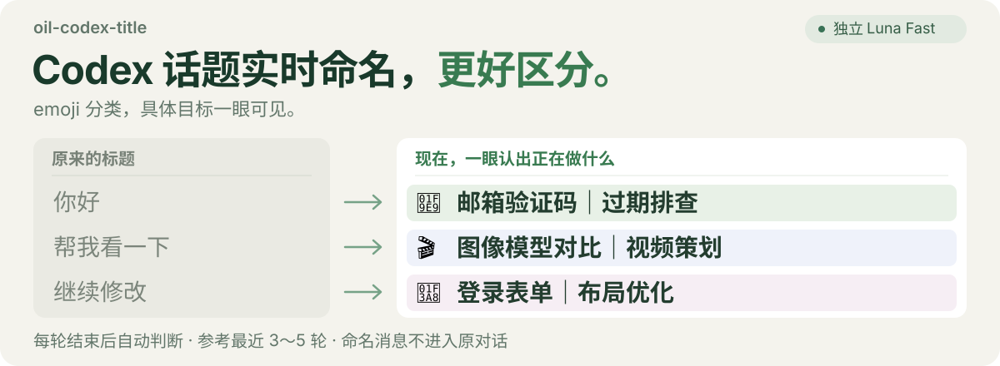

# Smart Session Title

  

让你的AI助手对话标题跟上你正在做的事情。每轮对话结束后，自动参考最近 3～5 轮内容更新标题，对话再多，也更容易找到。

## 支持的AI助手

- Claude Code
- Cursor
- Windsurf
- 其他支持插件系统的AI助手

## 一眼看出正在做什么

以下为命名效果示例：

| 原来的标题 | 更容易找回的标题 |
| --- | --- |
| 回应中文问候 | 🧩 邮箱验证码｜过期排查 |
| 确认注册功能 | 🧩 支付回调｜重复发货修复 |
| 讨论视频标题 | 🎬 图像模型评测｜视频策划 |
| 继续修改 | 🎨 登录表单｜布局优化 |

统一采用 **「类别 emoji + 对象｜目标」**，先找对象，再看正在做什么。

## 安装

复制下面这段话发给你的AI助手：

\`\`\`text
帮我查找 GitHub 仓库 async-artisan/smart-session-title，下载并安装完整插件，开启话题自动命名并检查是否生效。
\`\`\`

安装后，在新对话里正常聊天即可。

## 配置

默认使用 Claude Haiku 模型。你可以配置使用其他模型：

\`\`\`bash
python3 scripts/smart_session_title.py configure --model claude-sonnet-5
\`\`\`

## 日常使用

直接对AI助手说：

- "预览这个话题的新标题"
- "固定这个话题的标题"
- "暂停自动命名" / "恢复自动命名"

## 特性

- **对象在前**：把"CRT 转场""登录表单"等辨识词放到前面
- **类别固定**：🎬 内容制作、🧩 工具开发、🔎 对比调研、🎨 页面设计、📝 方法整理
- **名称稳定**：准确的对象名称尽量不变，只在工作目标实质变化时更新
- **不打断对话**：独立的模型在后台命名，不往原对话里添加消息
- **跟随你的语言**：根据最近几轮用户消息的主要语言命名

## 许可证

MIT
